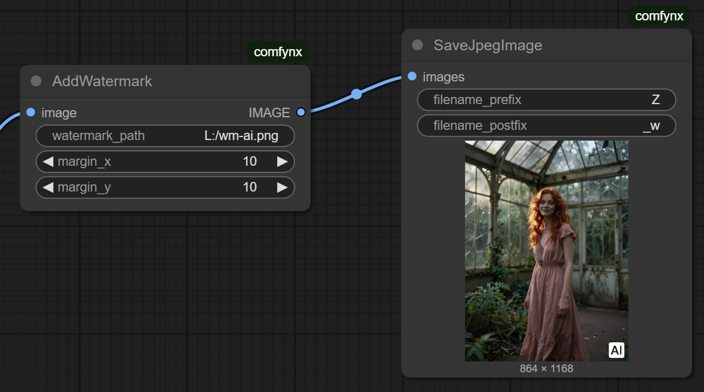
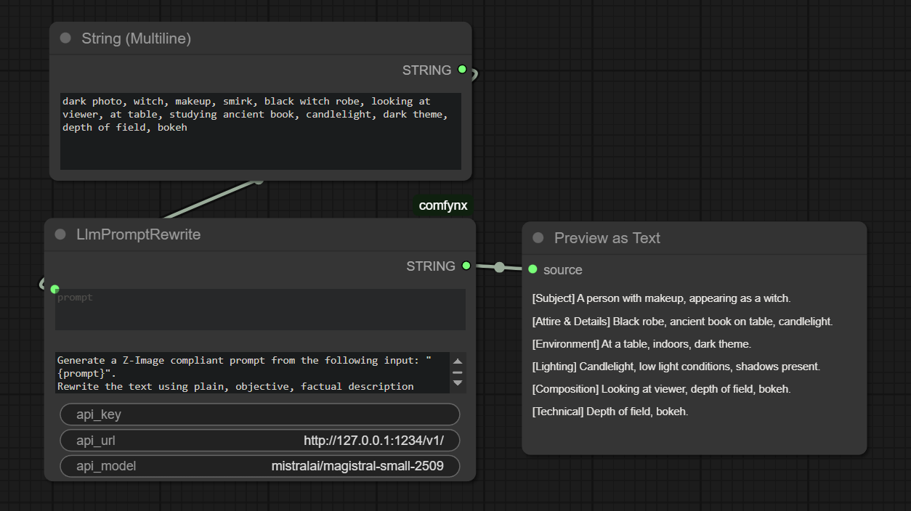
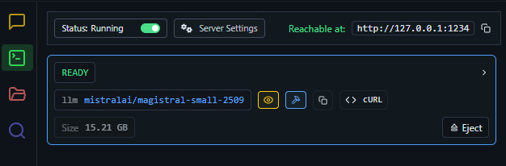

## Nodes

### LLM

This ComfyUI node `LlmPromptRewrite` performs model-based rewriting of text inputs
using the OpenAI Chat Completions API. The node accepts an input prompt and an
instruction template containing the placeholder "{prompt}". This placeholder is
replaced at runtime with the actual prompt and then sent to the selected OpenAI
model. The model’s rewritten output is returned as a string to the ComfyUI
dataflow.

Inputs
------
prompt : STRING
    The original text to be rewritten.

rewrite_instruction : STRING
    A rewrite instruction that may contain the "{prompt}" placeholder.
    The placeholder is automatically replaced before the API call.

openai_api_key : STRING
    API key used for authentication with the OpenAI endpoint.

model : STRING
    Name of the chat model to be used (e.g., "gpt-4.1-mini").

Output
------
STRING
    The rewritten version of the prompt generated by the model.

Use Cases
---------
This node is suitable for automatic text refinement, unifying writing style,
prompt-engineering pipelines, and any workflows requiring dynamic rewriting
of user input within ComfyUI.

Example for LM Studio: 
